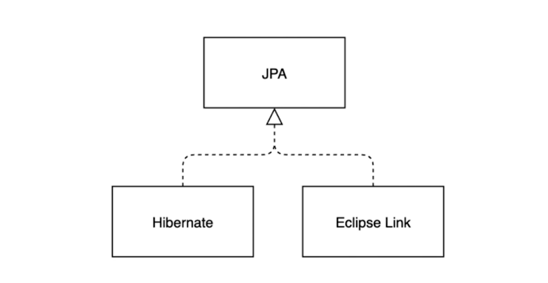
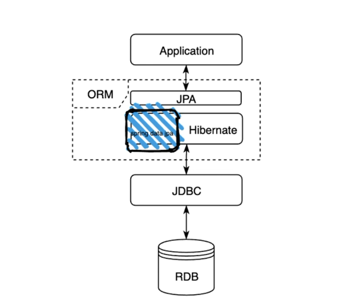

# JPA (Java Persistence API)

- JPA의 개념
  - [JPA 개념 정리 페이지](https://velog.io/@adam2/JPA%EB%8A%94-%EB%8F%84%EB%8D%B0%EC%B2%B4-%EB%AD%98%EA%B9%8C-orm-%EC%98%81%EC%86%8D%EC%84%B1-hibernate-spring-data-jpa)
  - The Java Persistence API(JPA), in 2019 renamed to Jakarta Persistence, is a Java application programming interface specification that describes the management of relational data in applications using Java Platform, Standard Edition and Java Platform, Enterprise Edition/Jakarta EE
  - ORM (Object Relational Mapping)
    - [ORM 개념 정리 페이지](https://gmlwjd9405.github.io/2019/02/01/orm.html)
    - 객체와 관계형 데이터베이스의 데이터를 자동으로 맵핑해 주는 것
    - 객체 지향 프로그래밍은 클래스를 사용하고, 관계형 데이터베이스는 테이블을 사용
    - 객체 모델과 관계형 모델 간에 불일치가 존재
    - ORM 을 통해 객체간의 관계를 바탕으로 SQL을 자동으로 생성하여 불일치를 해결
    - 데이터베이스 데이터 <----맵핑----> Object 필드
    - 객체를 통해 간접적으로 데이터베이스 데이터를 다룬다
  - JPA(Java Persistence API)
    - Java 진영의 ORM 표준
    - Persistence 영역(데이터)에 접근하기 위한 API의 규격
    - JPA Library(jakarta.persistence-api-2.2.3.jar) : IntelliJ >> Project Window >> External Libraries에서 확인 가능
    - JPA Library의 코드를 살펴보면, 대부분 Interface, Annotation, Enum로만 구성
    - 중요 Interface
      - EntityManager
  - JPA 구현체
    - Hibernate Library (주로 사용)
      - hibernate-core-5.4.32.Finar.jar : IntelliJ >> Project Window >> External Libraries에서 확인 가능
    - Eclipse Link    
      
  - Spring Data Jpa
    - Spring에서 Hibernate 라이브러리의 자주 쓰이는 기능들을 좀 더 간편하게 사용할 수 있도록, Wrapper Class형태로 감싸서 만들어 놓은 라이브러리
    - EntityManager에 직접 접근하지 않고, Data에 대한 접근을 좀 더 쉽고 객체지향적으로 처리할 수 있도록 해 줌
    - spring-boot-starter-data-jpa-2.5.5.jar : IntelliJ >> Project Window >> External Libraries에서 확인 가능
    - spring-data-jpa-2.5.5.jar
    - IntelliJ에 라이브러리와 관련된 source jar도 함께 배포 되므로, 실제 코드를 확인 가능

    
- JPA 구조도  


## IntelliJ IDE 

#### Ultimate Edition vs Community Edition

###### 공통으로 지원하는 기능

- Java, Kotlin, Groovy, Scalar
- Android
- Maven, Gradle, sbt
- Git, SVN, Mercurial
- 디버거

###### Community Edition에서 지원되지 않는 기능

- 프로파일링 도구
- Spring, Jakarta EE, Micronaut, Ouarkus, Helidon 등
- Swagger, Open API 사양
- JavaScript, TypeScript
- 데이터베이스 도구, SQL

#### 단축키(Short Key) 사용법

- 에디터 창에서 프로젝트 창으로 이동: Alt + 1
- 프로젝트 창에서 에디터 창으로 이동

  - 프로젝트 창을 닫으면서 이동: Alt + 1
  - 프로젝트 창을 다지 않고 이동: Esc Key
- 프로젝트 창에서 클래스 파일 선택 후, 소스 미리 보기: Space Key

  - 소스 미리 보기 상태에서 화살표 키를 이용해 클래스 파일 이동 가능
- 에디터 창 최대화/최소화: Ctrl + Shift + F12 
- 여러 개의 에디터 창 이동: Ctrl + Tab 키를 눌러서 팝업 창을 띄운 후, Tab키를 계속 눌러 소스 선택 
- 새 파일 생성 
  
  - 에디터 창에서 Ctrl + Alt + Insert 
  - 프로젝트 창에서 Alt + Insert
- 에디터 창에서 커서 이동    
  - 단어별 이동: Ctrl + <- ->
  - 라인 시작/끝 이동: home, end
  - 페이지 위/아래: page up, page down
- 소스 코드 선택 확장/축소: Ctrl + W/Ctrl + Shift + W
- 주석 처리 및 해제  
  - 한줄 주석: Ctrl + /
  - 블록 주석: Ctrl + Shift + /
- Indentation  
  - Indentation: Tab
  - Indentation: Shift + Tab
- 자동 Indentation: Ctrl + Alt + I  
  - Ctrl + A Key로 전체 소스 선택 후, 처리 가능
- 사용처 찾기: 해당 코드가 사용되는 곳을 찾음
  - 찾기: Alt + F7
  - 빠른 찾기: Ctrl + B
- 파일 내 검색
  - 찾기: Ctrl + F
  - 찾은 결과 아래로 이동: F3
  - 찾은 결과 위로 이동: Shift + F3
- 경로 내 검색: Ctrl + Shift + f  
  - "In Project", "Module", "Directory", "Scope" 등을 선택 
- 전체 검색: Shift를 두번 누름
  - IntelliJ안의 모든 범위에서 검색
  - 소스 뿐만 아니라, IntelliJ내의 기능도 검색 가능
- 최근 파일 열기: Ctrl + e
- Live template: Ctrl + j
  - main method: psvm 친 후, Ctrl + j
  - System.out.println(): sout을 친 후, Ctrl + j
  - Ctrl + j 키만 누르면, 제공해 주는 Live template의 리스트를 볼 수 있음
- QuickFix 기능: Alt + Enter  
  - "List<String> list;"와 같은 코드를 입력 하고, List에 커서를 둔 후, Alt + Enter를 치면 컴파일 에러를 해결할 후보들을 알려줌.
- 코드 이슈 별로 이동: F2, Shift + F2
  - 에러가 발생한 부분이 여러 곳일 경우, 이슈 별로 이동
  - 다음으로 이동:  F2
  - 이전으로 이동: Shift + F2
- 사용하지 않는 Import문 제거: Ctrl + Alt + o  ​	
- 코드 생성: Alt + Ins  
  - 생성자, Getter 또는 Setter를 생성할 때 주로 사용
  - 소스상에서 마우스 우측 버튼 클릭 후, "Generate"로도 가능
- 메소드 자동완성
  - override: Ctrl + o
  - implement: Ctrl + i
  - 소스상에서 마우스 우측 버튼 클릭 후, "Generate"로도 가능
- IntelliJ에서 제공하는 터미널 창 열기: Alt + F12
  - git command를 사용할 수 있음
- 구문 완성: Ctrl + Shift + Enter
- 대체하기
  - 파일 내 대체: Ctrl + r
  - 경로 내 대체: Ctrl + Shift + r
- Run Anything: Ctrl Key를 두번 누름
  - 최신 Run 목록이 제시됨
  - main() 메소드가 있는 클래스를 검색해서 실행해도 됨
- 실행
  - 에디터 실행: main() 메소드가 있는 소스 창에서 Ctrl + Shift + F10으로 실행
  - 가장 최근의 실행: Shift + F10
- 실행 중인 프로세스 종료: Ctrl + F2
- 라인 수정
  - 복사: Ctrl + d
  - 삭제: Ctrl + y
- 메소드의 파라메터 정보 보기: Ctrl + p
  - 사용하고 있는 메소드 명에서 키를 누르면, 정의된 메소드의 파라메터 정보를 볼 수 있음.  
- Quick Definition: Ctrl + Shift + i
  - 사용하고 있는 메소드 명에서 키를 누르면, 정의된 메소드의 선언부를 미리보기 할 수 있음.
- Quick Document: Ctrl + Q     
  - 사용하고 있는 메소드 명에서 키를 누르면, 정의된 메소드의 선언부의 API 정보를 볼 수 있음.
  - Java Doc으로 기록한 정보를 보여줌
- Java Doc 양식 생성: 메소드의 위에서 "/**"을 입력한 후, Enter 키 입력
- 기능(action) 찾기: Ctrl + Shift + A
  - 단축키 정보를 찾을 수 있음
  - Help > Keymap Reference: 단축키 문서를 보여줌.

#### 단축키 (Short Key) 응용편
- 테스트 코드 작성: Alt + Enter
  - 테스트 코드를 작성하고 싶은 소스 파일에서, "Alt + Enter"을 클릭
- 소스코드와 테스트 코드 번갈아 이동: Ctrl + Shift + t
  - 테스트 코드가 없다면 새로운 테스트를 작성하는 메뉴가 뜸
- 테스트 코드 실행 및 정지
  - 선택한 테스트 실행: Ctrl + Shift + F10
  - 정지 : Ctrl + F2
- 리팩토링
  - 클래스명을 선택 후, 다른 패키지로 이동: F6 (실제 참조하고 있는 코드도 모두 변경됨)
  - 바꾸고 싶은 타입을 선택 후, 타입 변경: Ctrl + Shift + F6
  - 메소드 시그니처 변경(접근자, 반환타입, 파라메터 타입): Ctrl + F6
  - 변수명 변경(관련된 모든 변수명이 변경됨): Shift + F6
  - 리팩토링 메뉴 전체 보기: Ctrl + Alt + Shift + t
- 디버깅
  - 브레이크 포인트 설정/해제: Ctrl + F8
  - 브레이크 포인트 목록 보기: Ctrl + Shift + F8 후, More 버튼을 누르면 전체 목록을 볼 수 있음.
  - 디버깅 모드 실행
    - 가장 최근의 실행: Shift + F9
	- 에디터 실행: 윈도우는 없음. 상단의 메뉴에서 Run > Debug 메뉴 이용
  - Step into: F7
  - Step over: F8
  - Resume Program(다음 브레이크 포인트 또는 끝까지): F9	
- Git
  - 간단한 Git 명령어 목록: alt + `  
- Custom Short Key 추가
  - shift Key를 두번 눌러 Keymap 검색
  - Configure Keymap 선택
  - "split" 검색 후, 해당 메뉴 선택
  - 마우스 오른쪽 키 눌러서, "add keyboard shortcut"

#### Spring Initializer 생성방법
1. "https://start.spring.io/"에 접속
2. "Gradle Project" 선택
3. Language "Java" 선택
4. Spring Boot에서 버전 선택
5. Articfact에 프로젝트 이름 기입
6. Packaging에서 "Jar" 선택
7. Java Version 선택
8. 우측의 Dependency 추가 - Spring Web, Spring Data JPA, H2 Database, Lombok
9. Generate
10. Zip 파일 생성
11. Explorer를 선택해서, 상세 정보 확인 가능
12. Zip파일의 압축을 푼 후, 내용을  Workspace로 복사
13. IntelliJ의 Open Project에서 build.gradle 파일을 선택해서 Open
14. Run 명령어를 실행

###### Spring Initializer 작명법
- Group
  - Domain 이름을 역순으로 기입
  
```text
com.fastcampus.jpa
```
- Artifact
  - 해당 프로젝트 이름
  - 생성 후, Group과 Artifact을 합친 package name이 기본적으로 생성
```text
bookmanager // com.fastcampus.jpa.bookmanager이라는 패키지가 기본적으로 생성됨.
```
- Type 
  - Maven
  - Gradle

- Language
  - Java
  - Kotlin
  - Grocvy

- Java version
  - 17
  - 11
  - 8

## Annotation Summary
#### Test 관련
- [Spring Test관련 Annotation 정리 사이트](https://happyer16.tistory.com/entry/Spring-Boot-Test-%EC%A2%85%ED%95%A9-%EC%A0%95%EB%A6%AC)
###### @SpringBootTest
- 통합 테스트
- 모든 빈을 등록하여 테스트를 진행
- classes 속성을 이용하여 필요한 빈만 등록하는 것이 유리
- @RunWith: JUnit의 러너를 사용하는게 아니라 지정된 SpringRunner 클래스를 사용
- @EnableConfigurationProperties : Configuration으로 사용하는 클래스를 빈으로 등록할 수 있게 함
```java
@RunWith(SpringRunner.class)
@SpringBootTest(
        properties = {
                "property.value=propertyTest",
                "value=test"
        },
        classes = {TestApplication.class},
        webEnvironment = SpringBootTest.WebEnvironment.RANDOM_PORT
)
@EnableConfigurationProperties(StayGolfConfiguration.class)
public class TestApplicationTests {

    @Value("${value}")
    private String value;

    @Value("${property.value}")
    private String propertyValue;

    @Test
    public void contextLoads() {
        assertThat(value, is("test"));
        assertThat(propertyValue, is("propertyTest"));
    }

}
@Getter
@Setter
@Configuration
@ConfigurationProperties(prefix = "supplier.staygolf")
public class StayGolfConfiguration {
```

###### @WebMvcTest
- 웹상에서 요청과 응답에 대한 테스트
- MVC 테스트를 가능하도록 Mock MVC를 생성
- @Controller, @ControllerAdvice, @JsonComponent와 Filter, WebMvcConfiguer, HandlerMethodArgumentResolver만 로드
- 전체 테스트보다는 가볍움
```java
@RunWith(SpringRunner.class)
@WebMvcTest(BookApi.class)
public class BookApiTest {

    @Autowired
    private MockMvc mvc;

    @MockBean
    private BookService bookService;

    @Test
    public void getBook_test() throws Exception {
        //given
        final Book book = new Book(1L, "title", 1000D);

        given(bookService.getBook()).willReturn(book);

        //when
        final ResultActions actions = mvc.perform(get("/books/{id}", 1L)
                .contentType(MediaType.APPLICATION_JSON_UTF8))
                .andDo(print());

        //then
        actions
                .andExpect(status().isOk())
                .andExpect(jsonPath("id").value(1L))
                .andExpect(jsonPath("title").value("title"))
                .andExpect(jsonPath("price").value(1000D))
        ;

    }
```
###### @DataJpaTest
- JPA 관련 테스트
- JPA 관련된 설정만 로드
- @Entity 클래스를 스캔하여 스프링 데이터 JPA 저장소를 구성
- 기본적으로 인메모리 데이터베이스를 이용
- 데이터소스의 설정이 정상적인지, JPA를 사용하서 데이터를 제대로 생성, 수정, 삭제하는지 등의 테스트가 가능
- @AutoConfigureTestDataBase : 데이터 소스를 어떤 걸로 사용할지에 대한 설정
  - Replace.Any : 기본적으로 내장된 데이터소스를 사용
  - Replace.NONE : @ActiveProfiles 기준으로 프로파일이 설정됨
- @DataJpaTest : 테스트가 끝날 때마다 자동으로 테스트에 사용한 데이터를 롤백
```java
**
	 * What the test database can replace.
	 */
	enum Replace {

		/**
		 * Replace any DataSource bean (auto-configured or manually defined).
		 */
		ANY,

		/**
		 * Only replace auto-configured DataSource.
		 */
		AUTO_CONFIGURED,

		/**
		 * Don't replace the application default DataSource.
		 */
		NONE

	}
@RunWith(SpringRunner.class)
@DataJpaTest
@ActiveProfiles("test")
@AutoConfigureTestDatabase(replace = AutoConfigureTestDatabase.Replace.NONE)
public class BookJpaTest {


    @Autowired
    private BookRepository bookRepository;

    @Test
    public void book_save_test() {
        final Book book = new Book("title", 1000D);
        final Book saveBook = bookRepository.save(book);
        assertThat(saveBook.getId(), is(notNullValue()));
    }

    @Test
    public void book_save_and_find() {
        final Book book = new Book("title", 1000D);
        final Book saveBook = bookRepository.save(book);
        final Book findBook = bookRepository.findById(saveBook.getId()).get();
        assertThat(findBook.getId(), is(notNullValue()));
    }
}
```
###### @RestClientTest
- REST 관련 테스트
- Rest 통신의 JSON 형식이 예상대로 응답을 반환하는지 등을 테스트
- @RestClientTest : 테스트 대상이 되는 빈을 주 입받음
- @Rule
- MockRestServiceServer
  - 클라이언트와 서버 사이의 REST 테스트를 위한 객체
  - 내부에서 RestTemplate을 바인딩하여 실제로 통신이 이루어지게끔 구성할 수 있음
  - 이 코드에서는 목 객체와 같이 실제 통신이 이루어지지는 않지만 지정한 경로에 예상되는 반환값을 명시함.
```java
@RunWith(SpringRunner.class)
@RestClientTest(BookRestService.class)
public class BookRestServiceTest {

    @Rule
    public ExpectedException thrown = ExpectedException.none();

    @Autowired
    private BookRestService bookRestService;

    @Autowired
    private MockRestServiceServer server;

    @Test
    public void rest_test() {

        server.expect(requestTo("/rest/test"))
                .andRespond(
                        withSuccess(new ClassPathResource("/test.json", getClass()), MediaType.APPLICATION_JSON));

        Book book = bookRestService.getRestBook();

        assertThat(book.getId(), is(notNullValue()));
        assertThat(book.getTitle(), is("title"));
        assertThat(book.getPrice(), is(1000D));

    }
}
// test.json
{
  "id": 1,
  "title": "title",
  "price": 1000
}
```
###### @JsonTest
- Json, Jackson의 테스트를 제공
```java
@RunWith(SpringRunner.class)
@JsonTest
public class BookJsonTest {

    @Autowired
    private JacksonTester<Book> json;

    @Test
    public void json_test() throws IOException {

        final Book book = new Book("title", 1000D);

        String content= "{\n" +
                "  \"id\": 0,\n" +
                "  \"title\": \"title\",\n" +
                "  \"price\": 1000\n" +
                "}";


        assertThat(json.parseObject(content).getTitle()).isEqualTo(book.getTitle());

        assertThat(json.write(book)).isEqualToJson("/test.json");
    }
}
```

###### @DisplayName
- method 명으로 표현하기 부족했다면 해당 어노테이션을 유용하게 사용
```java
@RunWith(SpringRunner.class)
@SpringBootTest
@DisplayName("어떤 클래스를 테스트")
public class TestApplicationTests {

    @Test
    @DisplayName("어떤 어떤 테스트를 진행")
    public void contextLoads() {
        assertThat(value, is("test"));
        assertThat(propertyValue, is("propertyTest"));
    }

}
```
###### Lifecycle Annotation
- @BeforeClass, @AfterClass -> @BeforeAll, @AfterAll
- @Before, @After -> @BeforeEache, @AfterEach

###### @Nested
- 중첩된 테스트 클래스
```java
@DisplayName("조회 테스트")
@Nested
class ReviewServiceTest {

	@DisplayName("여러 seq로 조회")
    @ParameterizedTest(name = "seq {0} 조회")
    @ValueSource(longs = { 1L, 2L })
    void getBySeq(Long seq){
    	Review review = reviewService.getByReviewSeq(seq);
        assertThat(review).isNotNull();
    }
}
```


## Lombok
- Annotation을 활용하여, Getter, Setter, Constructor, toString, hashCode등의 함수를 컴파일 시 생성토록 할 수 있음.
#### build.gradle 설정

```gradle
configurations {
	compileOnly {
		extendsFrom annotationProcessor
	}
}
....
dependencies {
    ....
	compileOnly 'org.projectlombok:lombok'
	annotationProcessor 'org.projectlombok:lombok'
	....
}
```

#### Annotation
- [참조 링크: https://www.daleseo.com/lombok-popular-annotations/ - 자주 사용되는 Lombok Annotation](https://www.daleseo.com/lombok-popular-annotations/)
- 파일을 컴파일할 때, 해당 코드들을 생성
- Lombok을 비적용을 해서 실제 생성 코드를 확인 가능
  - 마우스 오른쪽 클릭 > Refactor > Delombok 

###### @Getter
- 클래스 스코프에서 사용 시, 클래스 필드들에 대해서 getXXX() 메소드 자동 생성
- 필드 스코프에서 사용 시, 특정 필드에 대해서 getXXX() 메소드 자동 생성

###### @Setter
- 클래스 스코프에서 사용 시, 클래스 필드들에 대해서 setXXX() 메소드 자동 생성
- 필드 스코프에서 사용 시, 특정 필드에 대해서 setXXX() 메소드 자동 생성

###### @ToString
- 클래스의 toString() 메소드를 자동 생성
- ``exclude`` 엘리먼트를 통해 특정 필드를 제외 가능
- ``callSuper`` 엘리먼트를 통해 부모의 toString() 메소드 호출을 포함 가능
```javaa
@ToString(exclude = "password", callSuper = true)
public class User {
  private Long id;
  private String username;
  private String password;
  private int[] scores;
}
```
###### @NoArgsConstructor
- 인자가 없는 기본 생성자 코드 생성
- JPA의 경우, @NoArgsConstructor가 꼭 필요
  - Repository에서 Entity를 조회하는 경우에 Entity를 생성할 때 기본생성자를 이용하기 때문

###### @AllArgsConstructor
- 모든 필드들을 인자로 받아서 생성자 코드 생성

###### @RequiredArgsConstructor
- 별도로 지정된 필드가 없으면, 인자가 없는 기본 생성자 코드 생성
- @NonNull Annotation을 명시한 필드들을 이용한 생성자 코드 생성

```java
import lombok.*;

import java.time.LocalDateTime;

@ToString(exclude="email", callSuper = true)
@Getter
@Setter
@NoArgsConstructor
@AllArgsConstructor
@RequiredArgsConstructor
public class User {
    @NonNull
    private String name;
    @NonNull
    private String email;
    private LocalDateTime createdAt;
    private LocalDateTime updatedAt;
}
```
###### @EqualsAndHashCode
- equals()와 hashCode()에 대한 코드 생성

###### @Data
- ``@Getter``, ``@Setter``, ``@RequiredArgsConstructor``, ``@ToString``, ``@EqualsAndHashCode``을 한꺼번에 설정
- 주의할 사항으로 @NoArgsConstructor 또는 @AllArgsConstructor가 존재하면, @RequiredArgsConstructor을 설정하지 않음
  - @RequiredArgsConstructor를 명시적으로 설정해야 함

```java
import lombok.*;

import java.time.LocalDateTime;

@NoArgsConstructor
@AllArgsConstructor
@RequiredArgsConstructor
@Data
@Builder
public class User {
    @NonNull
    private String name;
    @NonNull
    private String email;
    private LocalDateTime createdAt;
    private LocalDateTime updatedAt;
}
```

###### @Builder
- Builder를 위한 클래스 코드 생성
- Builder의 형식을 가지고, 필드의 값을 주입
```java
import lombok.*;

import java.time.LocalDateTime;

@NoArgsConstructor
@AllArgsConstructor
@RequiredArgsConstructor
@Data
@Builder
public class User {
    @NonNull
    private String name;
    @NonNull
    private String email;
    private LocalDateTime createdAt;
    private LocalDateTime updatedAt;
}
```
```java
import lombok.Data;
import lombok.NonNull;
import lombok.RequiredArgsConstructor;

import java.time.LocalDateTime;

@NoArgsConstructor
@AllArgsConstructor
@RequiredArgsConstructor
@Data
public class User {
    @NonNull
    private String name;
    @NonNull
    private String email;
    private LocalDateTime createdAt;
    private LocalDateTime updatedAt;

    public static UserBuilder builder() {
        return new UserBuilder();
    }

    public static class UserBuilder {
        private @NonNull String name;
        private @NonNull String email;
        private LocalDateTime createdAt;
        private LocalDateTime updatedAt;

        UserBuilder() {
        }

        public UserBuilder name(@NonNull String name) {
            this.name = name;
            return this;
        }

        public UserBuilder email(@NonNull String email) {
            this.email = email;
            return this;
        }

        public UserBuilder createdAt(LocalDateTime createdAt) {
            this.createdAt = createdAt;
            return this;
        }

        public UserBuilder updatedAt(LocalDateTime updatedAt) {
            this.updatedAt = updatedAt;
            return this;
        }

        public User build() {
            return new User(name, email, createdAt, updatedAt);
        }

        public String toString() {
            return "User.UserBuilder(name=" + this.name + ", email=" + this.email + ", createdAt=" + this.createdAt + ", updatedAt=" + this.updatedAt + ")";
        }
    }
}
```

## Swagger
- Maven Repository에서 "[SpringFox Boot Starter](https://mvnrepository.com/artifact/io.springfox/springfox-boot-starter) " 검색

#### build.gradle 설정
```gradle
implementation group: 'io.springfox', name: 'springfox-boot-starter', version: '3.0.0'
```

#### 동작 확인
- "http://localhost:8080/swagger-ui/"에 접속하여 확인

 